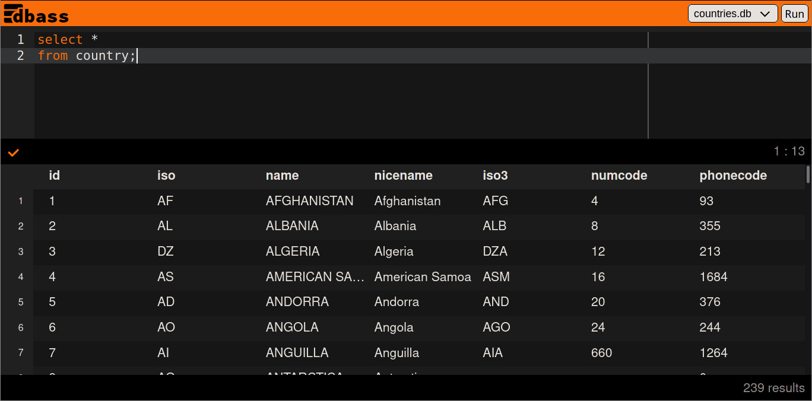

# dbass

This is a prototype for very simple online SQL editor.

- `server` directory contains the backend code. See [server/README.md](server/README.md)
- `ui` directory contains the UI code. See [ui/README.md](ui/README.md)

Some features
- SQL query execution
- UI editor with basic syntax checking
- (incomplete) UI editor syntax autocomplete with context specific suggestions
- Basic query result table viewer with dynamic column header rendering (the
  application figures out which columns are being queried and will render result
  with correct headers in the table
